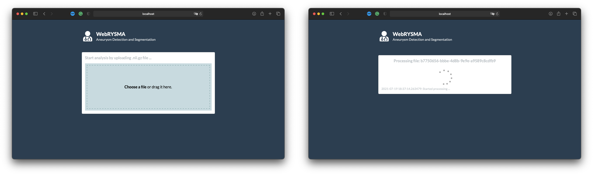
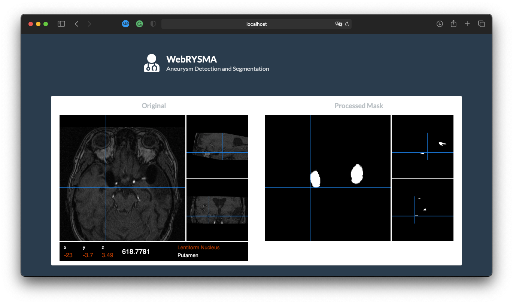
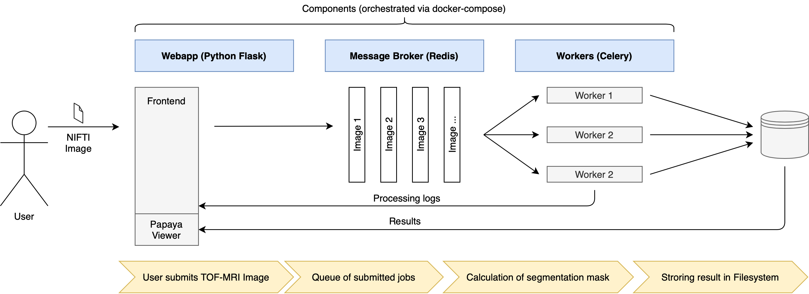

<!-- PROJECT LOGO -->
<br />
<p align="center">
  <a href="https://github.com/ethylomat/heiRYSMA">
    
  </a>
</p>


<!-- TABLE OF CONTENTS -->
<details open="open">
  <summary><h2 style="display: inline-block">Table of Contents</h2></summary>
  <ol>
    <li>
      <a href="#about-the-project">About The Project</a>
      <ul>
        <li><a href="#built-with">Built With</a></li>
      </ul>
    </li>
    <li>
      <a href="#getting-started">Getting Started</a>
      <ul>
        <li><a href="#installation">Installation</a></li>
        <li><a href="#training">Training</a></li>
        <li><a href="#evaluation">Evaluation</a></li>
      </ul>
    </li>
    <li>
      <a href="#webrysma">WebRYSMA</a>
      <ul>
        <li><a href="#webrysma-structure">WebRYSMA Structure</a></li>
        <li><a href="#running-webrysma">Running WebRYSMA</a></li>
      </ul>
    </li>
    <li><a href="#results">Results</a></li>
  </ol>
</details>


<!-- ABOUT THE PROJECT -->
## About The Project


<!-- BUILD WITH -->
### Built With

* []()
* []()
* []()


<!-- GETTING STARTED -->
## Getting Started


<!-- INSTALLATION -->
### Installation

- Clone the repo
```sh
$ git clone https://github.com/ethylomat/heiRYSMA.git
Cloning into 'heiRYSMA'...
remote: Enumerating objects: 488, done.
remote: Counting objects: 100% (488/488), done.
remote: Compressing objects: 100% (330/330), done.
...
$ cd heiRYSMA
```

For training the model first install all prerequisites as stated in the requirements.txt. We recommend using virtual environments (pyvenv or pipenv) to install all needed packages. Our sofware was developed and tested using Python Verion 3.8.5.

```sh
$ python --version # check python version
Python 3.8.5
$ python -m venv venv
$ . venv/bin/activate
$ pip install -r requirements.txt
```

<!-- TRAINING -->
### Training


- New models can be trained using the main function. To see all available parameters append `--help` to the command. Make sure the files in the data directory have the correct directory structure.
```sh
$ python -m src.main --help
usage: main.py [-h] [--data DATA_PATH] [--model-dir MODELS_PATH] [--resolution RESOLUTION RESOLUTION RESOLUTION] [--overlap OVERLAP] [--augmented] [--batch-size BATCH_SIZE] [--resizing]
               [--learning-rate LEARNING_RATE] [--existing-model] [--loss LOSS_METRIC]

optional arguments:
  -h, --help            show this help message and exit
  --data DATA_PATH      Absolute path of the data directory
  --model-dir MODELS_PATH
                        Absolute path of the model directory
  --resolution RESOLUTION RESOLUTION RESOLUTION
                        Dimension for cropping/resizing (e.g. 64 for dimension 64 x 64 x 64)
  --overlap OVERLAP     Overlap for cropping
  --augmented           Add flipped, rotated and brighter data
  --batch-size BATCH_SIZE
                        Batch size
  --resizing            Resizing (default is cropping)
  --learning-rate LEARNING_RATE
                        Learning rate
  --existing-model      Training of existing model (if exist)
```

- Example usage:
```sh
$ python -m src.main --data /Users/USER/Workspace/heiRYSMA/data --resolution "64 64 64" --overlap 10 --batch-size 8 --learning-rate 0.0001
Using data path:  /Users/USER/Workspace/heiRYSMA/data
Target resolution:  (64, 64, 64)
Overlap:  10
Batch size:  8
Include augmented data:  False
Include resizing:  False
Learning rate:  0.0001
Training existing model:  True
Model name:  model__DIC__64_64_64__o10__b08__lr0001 

...
```


<!-- EVALUATION -->
### Evaluation

<!-- WEBRYSMA -->
## WebRYSMA

WebRYSMA is a web application that can be used to run our detection/segmentation tool and visualizing the results in the webbrowser in an interactive way. It allows to upload files in .nii.gz (NIFTI) format which are then processed and displayed with possible aneurysms. The original image and result mask are displayed using the [Papaya](https://github.com/rii-mango/Papaya) JavaScript image viewer.

<p align="center">
  <a href="https://github.com/ethylomat/heiRYSMA">
    
  </a>
</p>

File upload page for NIFTI images (left), processing page showing progress of segmentation including log (right).

<p align="center">
  <a href="https://github.com/ethylomat/heiRYSMA">
    
  </a>
</p>

Interactive results page showing the original image (left) and the processed mask indicating possible aneurysms (right).

<!-- WEBRYSMA STRUCTURE -->
### WebRYSMA Structure

The WebRYSMA web application consists of different components to process the submitted data. The webserver used for the application is based on the Python [Flask](https://flask.palletsprojects.com/en/2.0.x/) framework. For the asynchronous processing of the data we decided to use [Redis](https://redis.io) as message broker and [Celery](https://docs.celeryproject.org/en/stable/) as a task queue and worker. The Celery workers call the processing routine of our detection.

<p align="center">
  <a href="https://github.com/ethylomat/heiRYSMA">
    
  </a>
</p>

<!-- RUNNING WEBRYSMA -->
### Running WebRYSMA

For running the web application WebRYSMA it is recommended to use [docker](https://docs.docker.com/) and [docker compose](https://docs.docker.com/compose/) to build containers running the application.

After installing docker and docker compose you can start the application by using the following command:

- Example usage:
```sh
$ docker-compose up
```

The web application can be accessed at `http://localhost:5001`, the Celery/Redis task queue can be accessed at `http://localhost:5555`.  

<!-- RESULTS -->
## Results

## Disclaimer

We provide medical related software (heiRYSMA/WebRYSMA) that are only intended for usage for educational purposes. By using the system in any way you agree that our software is:

(i) limited for using for educational purposes  
(ii) especially not certified as a medical product and not usable for any clinical or diagnostic use  
(iii) only used in compliance with all applicable laws and regulations  

By using this software you especially agree that you will use the software following the rules of this disclaimer. 

Application of this software for real cases could cause serious injury or death. False predictions cannot be prevented.
We provide the software “as is“ and specially disclaim all warranties of any kind. 
In no event we will be liable for any causes with using the software, especially those of injury or death.