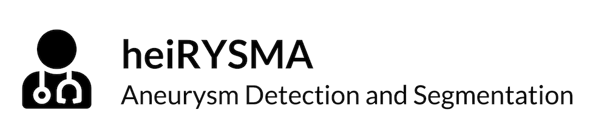

<!-- PROJECT LOGO -->
<br />
<p align="center">
  <a href="https://github.com/ethylomat/heiRYSMA">
    
  </a>

  <h3 align="center">heiRYSMA</h3>

  <p align="center">
    Aneurysm Detection and Segmentation<br>
    Project Seminar Biomedical Image Analysis
  </p>
</p>


<!-- TABLE OF CONTENTS -->
<details open="open">
  <summary><h2 style="display: inline-block">Table of Contents</h2></summary>
  <ol>
    <li>
      <a href="#about-the-project">About The Project</a>
      <ul>
        <li><a href="#built-with">Built With</a></li>
      </ul>
    </li>
    <li>
      <a href="#getting-started">Getting Started</a>
      <ul>
        <li><a href="#installation">Installation</a></li>
        <li><a href="#training">Training</a></li>
        <li><a href="#evaluation">Evaluation</a></li>
      </ul>
    </li>
    <li><a href="#results">Results</a></li>
  </ol>
</details>


<!-- ABOUT THE PROJECT -->
## About The Project


<!-- BUILD WITH -->
### Built With

* []()
* []()
* []()


<!-- GETTING STARTED -->
## Getting Started


<!-- INSTALLATION -->
### Installation

- Clone the repo
```sh
$ git clone https://github.com/ethylomat/heiRYSMA.git
Cloning into 'heiRYSMA'...
remote: Enumerating objects: 488, done.
remote: Counting objects: 100% (488/488), done.
remote: Compressing objects: 100% (330/330), done.
...
$ cd heiRYSMA
```

For training the model first install all prerequisites as stated in the requirements.txt. We recommend using virtual environments (pyvenv or pipenv) to install all needed packages. Our sofware was developed and tested using Python Verion 3.8.5.

```sh
$ python --version # check python version
Python 3.8.5
$ python -m venv venv
$ . venv/bin/activate
$ pip install -r requirements.txt
```

<!-- TRAINING -->
### Training


- New models can be trained using the main function. To see all available parameters append `--help` to the command. Make sure the files in the data directory have the correct directory structure.
```sh
$ python -m src.main --help
usage: main.py [-h] [--data DATA_PATH] [--model-dir MODELS_PATH] [--resolution RESOLUTION RESOLUTION RESOLUTION] [--overlap OVERLAP] [--augmented] [--batch-size BATCH_SIZE] [--resizing]
               [--learning-rate LEARNING_RATE] [--existing-model] [--loss LOSS_METRIC]

optional arguments:
  -h, --help            show this help message and exit
  --data DATA_PATH      Absolute path of the data directory
  --model-dir MODELS_PATH
                        Absolute path of the model directory
  --resolution RESOLUTION RESOLUTION RESOLUTION
                        Dimension for cropping/resizing (e.g. 64 for dimension 64 x 64 x 64)
  --overlap OVERLAP     Overlap for cropping
  --augmented           Add flipped, rotated and brighter data
  --batch-size BATCH_SIZE
                        Batch size
  --resizing            Resizing (default is cropping)
  --learning-rate LEARNING_RATE
                        Learning rate
  --existing-model      Training of existing model (if exist)
```

- Example usage:
```sh
$ python -m src.main --data /Users/USER/Workspace/heiRYSMA/data --resolution "64 64 64" --overlap 10 --batch-size 8 --learning-rate 0.0001
Using data path:  /Users/USER/Workspace/heiRYSMA/data
Target resolution:  (64, 64, 64)
Overlap:  10
Batch size:  8
Include augmented data:  False
Include resizing:  False
Learning rate:  0.0001
Training existing model:  True
Model name:  model__DIC__64_64_64__o10__b08__lr0001 

...
```

<!-- EVALUATION -->
### Evaluation


<!-- RESULTS -->
## Results

